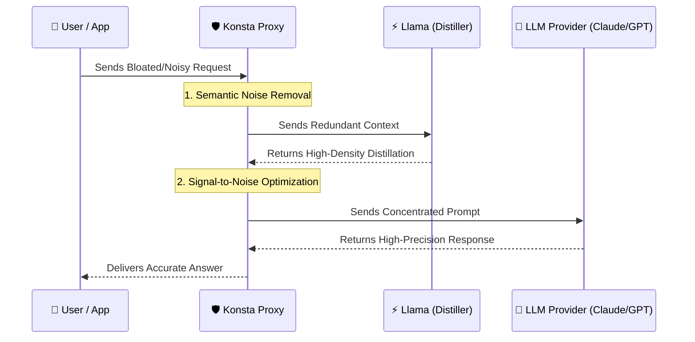

# 🌌 Konsta: High-Fidelity Context Optimization Proxy

**Konsta** is an advanced context optimization layer designed to eliminate "prompt noise" and drastically reduce LLM hallucinations. By transforming bloated, redundant prompts into high-density semantic extracts, Konsta ensures that your LLM focuses only on the critical information, resulting in higher accuracy and superior reasoning.

While most proxies focus solely on cost, **Konsta focuses on Signal-to-Noise Ratio (SNR)**. We don't just compress; we distill.

---

## 🎯 The Core Value: Quality Over Everything

### 🛡️ Anti-Hallucination & Anti-Noise
Large contexts often lead to the **"Lost in the Middle"** phenomenon, where LLMs ignore critical facts buried in noise. Konsta solves this by:
- **Semantic Deduplication**: Removing redundant and contradictory information using local embeddings.
- **Context Distillation**: Using a specialized LLM to rewrite complex contexts into a concentrated, high-density format.
- **Concentrated Focus**: Providing the target model with only the essential facts, which directly reduces hallucinations and increases factual precision.

### 💰 Economic Efficiency
Because Konsta delivers high-density prompts, you naturally achieve:
- **60-80% Reduction** in input token costs.
- **Faster Time-to-First-Token (TTFT)** due to smaller prompt processing.
- **Distillation Arbitrage**: Using a fast, cheap model (e.g., Llama-3.1-8B) to optimize prompts for a premium flagship.

---

## 🔄 Request Flow Architecture


---

## 🚀 Getting Started

### 1. Environment Setup
```bash
git clone https://github.com/QxFx0/Konsta.git
cd Konsta
python3 -m venv venv
source venv/bin/activate
pip install -r requirements.txt
```

### 2. Configuration & API Keys
Konsta is configured via environment variables.

**Required Keys:**
- `LLM_API_KEY`: Your **Cerebras** API key (used for the distiller).
- `KONSTA_AUTH_TOKEN`: (Recommended) Token for proxy authorization. Requests without this token will be rejected with `401 Unauthorized`.

**Example setup:**
```bash
export LLM_API_KEY="your_cerebras_api_key_here"
export KONSTA_AUTH_TOKEN="your_secure_proxy_token"
```

---

## 📦 Using Konsta

### Option A: The Demo CLI
Perfect for seeing how a prompt is compressed without setting up a proxy.
```bash
python3 -m demo.demo_cli
```

### Option B: Full Transparent Proxy
Run Konsta as a middleware to intercept and compress traffic on the fly.
```bash
python3 -m src.main
```
- **Proxy Address:** `http://127.0.0.1:8080`
- **Auth:** Include `Proxy-Authorization: Bearer <KONSTA_AUTH_TOKEN>` in your requests.

#### HTTPS Interception and the CA Trust Store
To transparently decrypt HTTPS traffic, Konsta requires a self-signed root CA. 
- By default, it generates local CA files in `~/.mitmproxy/`.
- To install the CA system-wide (requires sudo), use:
  ```bash
  python3 -m src.main --install-ca
  ```

#### CA Private Key Passphrase
Konsta resolves the CA passphrase via:
1. `CA_KEY_PASSWORD` environment variable (best for CI/Servers).
2. OS keyring.
3. Interactive prompt (first run only).

---

## 🩺 `doctor` -- Health Checks
Run the built-in diagnostic tool to verify your installation:
```bash
python3 -m src.main doctor
```
It checks CA files, passphrase reachability, API key presence, endpoint connectivity, and embedding engine status.

---

## 🧱 Architecture
Konsta is built with a strict separation of concerns:
- **`ProxyAdapter`**: Decouples the core engine from the proxy library (`mitmproxy`).
- **`KonstaEngine`**: Manages the pipeline of semantic deduplication and distillation.
- **`DistillationWorker`**: An async background worker that ensures the proxy never blocks on remote LLM calls.
- **`CircuitBreaker`**: Protects the system from cascading failures if the distillation provider is stalled.

## 📜 License
MIT License.

