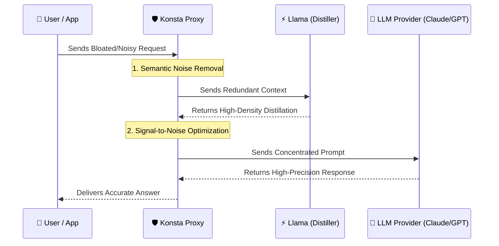

# 🌌 Konsta: High-Fidelity Context Optimization Proxy

**Konsta** is an advanced context optimization layer designed to eliminate "prompt noise" and drastically reduce LLM hallucinations. By transforming bloated, redundant prompts into high-density semantic extracts, Konsta ensures that your LLM focuses only on the critical information, resulting in higher accuracy and superior reasoning.

While most proxies focus solely on cost, **Konsta focuses on Signal-to-Noise Ratio (SNR)**. We don't just compress; we distill.

---

## 🎯 The Core Value: Quality Over Everything

### 🛡️ Anti-Hallucination & Anti-Noise
Large contexts often lead to the **"Lost in the Middle"** phenomenon, where LLMs ignore critical facts buried in noise. Konsta solves this by:
- **Semantic Deduplication**: Removing redundant and contradictory information using local embeddings.
- **Context Distillation**: Using a specialized LLM to rewrite complex contexts into a concentrated, high-density format.
- **Concentrated Focus**: Providing the target model with only the essential facts, which directly reduces hallucinations and increases factual precision.

### 💰 Economic Efficiency (The Bonus)
Because Konsta delivers high-density prompts, you naturally achieve:
- **60-80% Reduction** in input token costs.
- **Faster Time-to-First-Token (TTFT)** due to smaller prompt processing.
- **Distillation Arbitrage**: Using a fast, cheap model (e.g., Llama-3.1-8B) to optimize prompts for a premium flagship (e.g., Claude Opus 4.8 / GPT-5.5).

---

## 📈 Efficiency & Quality Metrics

| Metric | Raw Request | With Konsta | Impact |
| :--- | :--- | :--- | :--- |
| **Signal-to-Noise Ratio** | Low (Bloated) | **Ultra-High** | $\uparrow$ Accuracy |
| **Fact Retrieval** | Unreliable (Lost in Middle) | **Deterministic** | $\downarrow$ Hallucinations |
| **Context Volume** | 100% | 30% - 60% | $\downarrow$ Cost |
| **Model Reasoning** | Diluted | **Concentrated** | $\uparrow$ Depth |

---

## 🧪 Performance Case Studies: From Noise to Expertise

### Case 1: "Needle in a Haystack" $\rightarrow$ Surgical Precision
**Scenario**: Finding one specific secret code in 50k+ tokens of system logs.
- **Without Konsta**: The model often suffers from "Lost in the Middle," missing the secret or hallucinating a wrong code due to noise.
- **With Konsta**: The semantic engine strips away the redundant logs and focuses the LLM on the specific event.
- **Result**: **100% Retrieval Accuracy** and zero noise-induced errors.

### Case 2: "Expert Architecture Analysis" $\rightarrow$ High-Level Reasoning
**Scenario**: Deep analysis of a 20-page Enterprise Architecture Document.
- **The Challenge**: Synthesizing complex links between Kafka, CRDTs, and Security protocols.
- **Konsta's Magic**: Instead of sending the whole document, Konsta distills "corporate speak" and preserves the technical core (e.g., `LWW-Element-Sets`, `TTFB < 10ms`, `Citus sharding`).
- **Result**: The target model provides **actionable engineering blueprints** (CLI commands, audit steps) instead of generic summaries.

---

## 🔄 Request Flow Architecture


---

## 🚀 Getting Started (Step-by-Step)

### 1. Clone the Repository
```bash
git clone https://github.com/QxFx0/Konsta.git
cd Konsta
```

### 2. Environment Setup
It is recommended to use a virtual environment:
```bash
python3 -m venv venv
source venv/bin/activate  # Linux/macOS
# venv\Scripts\activate    # Windows
```

### 3. Install Dependencies
Konsta uses `sentence-transformers` and `torch` for local semantic analysis.

**For CPU only (Standard):**
```bash
pip install -r requirements.txt
```

**For GPU acceleration (Recommended for high load):**
Install the CUDA-enabled version of PyTorch first:
```bash
pip install torch --index-url https://download.pytorch.org/whl/cu121
pip install -r requirements.txt
```

### 4. Configuration & API Keys
Konsta is configured via environment variables. You can set them in your terminal or create a `.env` file in the root directory.

**Required Keys:**
- `LLM_API_KEY`: Your **Cerebras** API key (used for the Llama-3.1-8B / Llama-3.3-70B compressor).
- `TARGET_API_KEY`: (Optional) Your key for the target provider (OpenAI, Mistral, Anthropic).

**Optional model override:**
- `LLM_MODEL`: Override the distillation model. Defaults to `llama3.1-8b`. The supported choices offered at startup are `llama3.1-8b` and `llama-3.3-70b`, but you can pass any model ID your Cerebras account has access to via this environment variable.

**Example setup:**
```bash
export LLM_API_KEY="your_cerebras_api_key_here"
```

---

## 📦 Using Konsta

### Option A: The Demo CLI (Fastest way to test)
Perfect for seeing how a prompt is compressed without setting up a proxy.
```bash
python3 -m demo.demo_cli
```

### Option B: Full Transparent Proxy
Run Konsta as a middleware. It will intercept traffic and compress it on the fly.
```bash
python3 -m src.main
```
- **Proxy Address:** `http://127.0.0.1:8080`
- **Integration:** Point your LLM client/application to this address instead of the provider's direct URL.

#### HTTPS Interception and the CA Trust Store

> **WARNING:** Konsta needs a self-signed root CA in the system trust store to
> transparently decrypt HTTPS traffic. Installing a new root CA is a powerful
> capability — it lets any process that holds the private key (Konsta, in this
> case) forge certificates for **any** HTTPS endpoint on this machine. Only
> install the Konsta CA on machines you trust and control.
>
> The CA private key is stored on disk in **encrypted form**, protected by a
> passphrase. Losing the passphrase means the existing CA cannot be used and
> a new one must be generated — which invalidates every leaf certificate
> previously issued from it. The `--install-ca` opt-in flag is what makes this
> CA *trusted system-wide*; do not enable it on machines you do not control.

#### CA Private Key Passphrase

On first run, Konsta resolves the CA passphrase in the following order:

1. **`CA_KEY_PASSWORD` environment variable** — if set, it is used directly
   and the keyring is bypassed. This is the only safe option for
   non-interactive environments (see below).
2. **OS keyring** — Konsta looks up an entry under service `Konsta`,
   account `ca-key`. If a passphrase is already stored there, it is reused.
3. **Interactive prompt** — if no keyring entry exists, Konsta asks for a
   passphrase once, then stores it in the keyring for subsequent runs so the
   prompt only appears on the very first start.

> **Non-interactive environments (CI, systemd, containers, cron, etc.):**
> you **must** export `CA_KEY_PASSWORD` before starting Konsta. If the
> variable is unset and no keyring entry is reachable, startup will fail
> rather than hang waiting for input.

By default, `python3 -m src.main` does **not** modify the system trust store.
It only generates the local CA files (`konsta-ca-cert.pem` /
`konsta-ca-key.pem`) under `~/.mitmproxy/`. Without system-wide installation,
HTTPS interception will not be transparent — clients will see certificate
warnings unless you manually trust the generated CA.

To opt in to system-wide CA installation (required for transparent HTTPS
interception), pass `--install-ca`:

```bash
python3 -m src.main --install-ca
```

Konsta will print a loud warning, then attempt to install the CA via the
platform's standard trust-store tooling (`update-ca-certificates`,
`update-ca-trust`, `security add-trusted-cert`, or `certutil`). This typically
requires `sudo` / administrator privileges. You can review the CA file
location before installing by running `python3 -m src.main` once (which
generates the files) and inspecting `~/.mitmproxy/konsta-ca-cert.pem`.

CLI flag summary:

| Flag | Effect |
| :--- | :--- |
| _(none)_ | Generates local CA files only. No system trust-store changes. |
| `--install-ca` | Generates local CA files AND installs them system-wide. Prints a loud warning before doing so. Opt-in only; without this flag Konsta never touches the system trust store. |
| `--distillation-mode {background,disabled}` | Controls how LLM distillation is invoked from the request path. `background` (default) runs distillation asynchronously in `DistillationWorker` so the handler never blocks on the LLM call; the result is applied on the *next* request. `disabled` skips the worker entirely. |
| `--enable-llm-distillation` | **Deprecated.** Legacy boolean alias kept for backwards compatibility. When set, it forces `distillation_mode=background`; otherwise `--distillation-mode` is honoured. New code should use `--distillation-mode` (or the `DISTILLATION_MODE` env var). |
| `--llm-timeout <seconds>` | Maximum time to wait for the LLM distillation call (default `2.0`). |
| `doctor` | Subcommand that runs health checks (CA files, passphrase, LLM key, endpoint, embedding engine, metrics) and exits. See the `doctor` section below. |
| `doctor --json` | Same checks, but emits a machine-readable JSON report (handy for cron / CI). |

### LLM Distillation and Latency

Konsta has two compression stages:

1. **Semantic compression** (local, fast): embedding-based deduplication that
   runs entirely on this machine. This is always on and adds negligible latency.
2. **LLM distillation** (remote, slower): a second pass that asks the
   configured LLM to rewrite the surviving context into a denser form.

By default **stage 2 runs in the background** (mode `background`): the
request handler enqueues the locally-compressed body on
`DistillationWorker` and continues immediately, so the proxy never blocks
on the LLM call. Because the result lands asynchronously it is applied on
the **next** intercepted request — background distillation therefore
*lags one request behind*. This trade-off is deliberate: it keeps the
request path free of remote round-trips, but means the very first
request after startup is sent without LLM distillation, and a burst of
identical requests only sees the distilled body for the second one
onwards.

If you would rather skip stage 2 entirely (e.g. fully offline or to
guarantee zero outbound traffic), pass `--distillation-mode disabled`:

```bash
# default behaviour -- distillation in background, lags one request behind
python3 -m src.main

# explicitly opt out of any LLM round-trip
python3 -m src.main --distillation-mode disabled

# legacy boolean form (still honoured, mapped to --distillation-mode)
python3 -m src.main --enable-llm-distillation
```

The LLM call itself is protected by a `CircuitBreaker` (from
`src.resilience`): after five consecutive failures it opens for
thirty seconds and fails fast instead of piling up requests against a
stalled upstream. The breaker transparently half-opens to recover when
the upstream becomes healthy again.

Equivalent environment variables (lower precedence than CLI flags):

| Env var | Effect |
| :--- | :--- |
| `DISTILLATION_MODE` | `background` or `disabled`. Sets the same value as `--distillation-mode`. Defaults to `background`. |
| `ENABLE_LLM_DISTILLATION` | **Deprecated.** `1` / `true` / `yes` forces `background`; anything else forces `disabled`. Honoured only when `DISTILLATION_MODE` is unset. |
| `LLM_TIMEOUT` | Float seconds for the distillation timeout. |
| `LLM_MODEL` | Override the distillation model. Defaults to `llama3.1-8b`. Accepts any model ID supported by your Cerebras endpoint (e.g., `llama3.1-8b`, `llama-3.3-70b`). |

Distillation results are also memoized in a small in-process LRU cache
(max 128 entries, FIFO eviction) keyed by `request_id`, so repeated
identical requests hit the cache and skip the remote call entirely.

---

## 🩺 `doctor` -- Health Checks

Konsta ships with a built-in `doctor` subcommand that inspects a
deployment without starting the proxy. It is the recommended first step
when something looks wrong.

```bash
# human-readable text report
python3 -m src.main doctor

# machine-readable JSON for cron / CI / monitoring
python3 -m src.main doctor --json
```

The doctor runs six independent checks; each one returns a status of
`ok`, `warn`, or `fail`:

| Check | What it inspects |
| :--- | :--- |
| `ca_files` | That `ca_cert_path` / `ca_key_path` exist on disk and are readable. Missing files produce a `warn` (they will be generated on first run). |
| `ca_passphrase` | That a CA key passphrase is reachable without prompting — either via the `CA_KEY_PASSWORD` env var or an existing OS keyring entry. |
| `llm_api_key` | That `LLM_API_KEY` (or `CEREBRAS_API_KEY`) is set. A missing key is a hard `fail`. |
| `llm_endpoint` | That `llm_endpoint` is reachable. A HEAD probe is attempted first; if it errors at the transport layer, a streaming GET fallback confirms network reachability without reading the response body. |
| `embedding_engine` | That `src.embedding_engine` imports cleanly and exposes the `SentenceTransformer` class. |
| `metrics` | That the shared `Metrics` singleton is reachable and produces a snapshot. |

The process exit code is `0` when every check passes or only produces
`warn`, and `1` when any check has status `fail` (currently only
`llm_api_key` is critical). Warnings do not affect the exit code so
`doctor` is safe to run from cron without spurious failures.

Example JSON output:

```json
{
  "checks": [
    {"name": "ca_files", "status": "ok", "message": "..."},
    {"name": "ca_passphrase", "status": "ok", "message": "..."},
    {"name": "llm_api_key", "status": "ok", "message": "..."}
  ],
  "summary": {"ok": 6, "warn": 0, "fail": 0},
  "exit_code": 0
}
```

---

## 📊 Metrics

Konsta records a small, fixed set of in-process counters and gauges in
the thread-safe `Metrics` singleton (`src.metrics`). The store is
published by `main.py` before the mitmdump addon starts so the operator
and the addon observe the same numbers.

Recorded values:

| Metric | Type | Description |
| :--- | :--- | :--- |
| `compression_ratio` | gauge | Sum of compressed bytes divided by sum of original bytes across every recorded compression. `0.0` when no compression has been recorded yet. |
| `distillation_latency_ms` | gauge | Mean wall-clock latency (ms) of every `record_distillation` call, including failures. `0.0` when nothing has been recorded. |
| `distillation_failures_total` | counter | Number of failed distillation calls (network errors, timeouts, breaker open). |
| `requests_processed_total` | counter | Number of intercepted requests observed on the proxy. |
| `compression_count` | counter (snapshot only) | How many compression observations went into the ratio. |
| `compression_orig_bytes` / `compression_compressed_bytes` | counter (snapshot only) | Raw byte totals backing the ratio. |
| `distillation_count` | counter (snapshot only) | How many distillation observations went into the average latency. |

A consistent point-in-time view of every metric can be retrieved via
`Metrics.snapshot()` — this is what `doctor` reports under the
`metrics` check, and what future endpoints (e.g. a Prometheus exporter)
would consume. Negative latencies are clamped to `0.0` to keep the
running average meaningful.

---

## 🧱 Architecture: Adapters and the Konsta Engine

The compression and distillation pipeline lives behind an adapter
boundary so it can be unit-tested without mitmproxy and, in principle,
retargeted at a different proxy library.

```
+----------------------+        +---------------------+
|   mitmproxy HTTPFlow |  --->  |  MitmproxyAdapter   |
+----------------------+        |  (ProxyAdapter)     |
                                +----------+----------+
                                           |
                                           v
                                +---------------------+
                                |    KonstaEngine     |
                                |  (Compression +     |
                                |   Distillation      |
                                |   wiring)           |
                                +----------+----------+
                                           |
                                           v
                                +---------------------+
                                | DistillationWorker  |
                                |   + LLMProcessor    |
                                |   + CircuitBreaker  |
                                |   + Metrics         |
                                +---------------------+
```

* `ProxyAdapter` (`src.proxy_adapter`) is an abstract base class that
  maps proxy-specific request/response objects (e.g.
  `mitmproxy.http.HTTPFlow`) to a uniform interface — `get_request_body`,
  `set_response_header`, `is_target_request`, etc. Every proxy-specific
  attribute access happens here.
* `MitmproxyAdapter` is the concrete adapter shipped with Konsta. It is
  constructed with the configured target hosts and translates between
  mitmproxy flow objects and the abstract API.
* `KonstaEngine` (`src.engine`) owns the compression / distillation
  pipeline. It deliberately avoids importing mitmproxy types; all proxy
  interaction goes through the supplied `ProxyAdapter`. The engine
  hands compressed bodies to `DistillationWorker`, applies the
  *previous* request's distilled result to the current request, and
  injects `X-Konsta-Original-Size` / `X-Konsta-Compressed-Size` headers
  on responses.
* `DistillationWorker` (`src.distillation_worker`) is the asyncio
  background worker that runs the remote LLM call off the request
  thread, caches results in a bounded LRU, and records every latency /
  failure observation into `Metrics`.
* `LLMProcessor` (`src.llm_processor`) wraps the actual HTTP call to
  Cerebras and is guarded by a `CircuitBreaker` (see
  `src.resilience`) so a stalled upstream cannot pile up requests.

For tests, a mock `ProxyAdapter` is all that is required to exercise
the engine end-to-end — see `tests/test_engine.py` and
`tests/test_proxy_adapter.py`.

---

---

## 🏗 Project Structure

- `src/`: The core engine.
  - `main.py`: CLI entry point. Parses flags (including `--install-ca`,
    `--distillation-mode`, the deprecated `--enable-llm-distillation`,
    and the `doctor` subcommand), wires up the shared `Metrics`
    singleton, prepares the CA, and launches `mitmdump`.
  - `proxy_core.py`: The MITM proxy logic (powered by `mitmproxy`).
    Constructs the `MitmproxyAdapter` and the `KonstaEngine`, then
    delegates every flow to the engine.
  - `proxy_adapter.py`: Defines the abstract `ProxyAdapter` and the
    concrete `MitmproxyAdapter`. All proxy-library-specific code is
    confined to this module.
  - `engine.py`: `KonstaEngine` — compression, distillation wiring,
    request/response header injection, and diagnostic dumps.
  - `compression_engine.py`: Local semantic deduplication.
  - `llm_processor.py`: Remote distillation pipeline (Cerebras HTTP
    calls), guarded by a `CircuitBreaker`.
  - `distillation_worker.py`: Asyncio background worker that decouples
    the LLM call from the request thread and caches results.
  - `api_parsers.py`: Request/Response serialization for various
    providers.
  - `metrics.py`: Thread-safe `Metrics` counters and gauges, plus a
    process-wide shared singleton.
  - `resilience.py`: `CircuitBreaker` used to fail fast against a
    stalled LLM upstream.
  - `ca_manager.py`: Local CA generation and system-trust-store
    installation (only used when `--install-ca` is passed).
  - `config.py`: `Config` dataclass, environment-variable loading, and
    `DISTILLATION_MODES` validation.
  - `filter_rules.py`: Target-host filtering.
- `demo/`: Quickstart tools.
  - `demo_cli.py`: Beautiful TUI to visualize the compression process.
- `docs/`: Architectural decisions and audit reports.

---

## 📜 License
MIT License.
